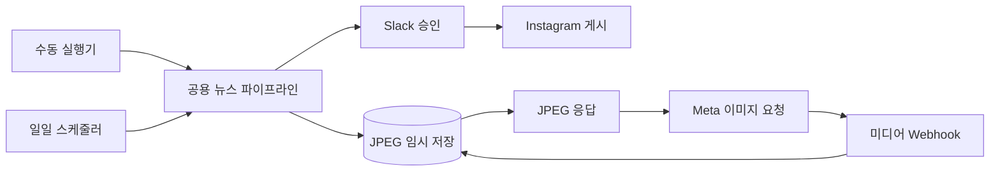

# Semifeed 운영 가이드

반도체 뉴스를 RSS에서 수집하고, OpenRouter로 카드 문구를 생성한 뒤 Slack 승인 후 Instagram에 게시하는 n8n 파이프라인입니다.



운영 배포의 권장 구성은 Google Compute Engine 단일 VM, Docker Compose, Tailscale Funnel입니다. Funnel이 공개 HTTPS를 제공하므로 별도 도메인이 필요 없고, Google Cloud 방화벽에 n8n의 5678 포트나 browserless의 3000 포트를 열지 않습니다.

## 1. 저장소 구성

```text
config/n8n.env                       n8n 서버의 비민감 실행 설정
config/semifeed.json                 RSS·Slack 채널·Instagram 계정 등 워크플로우 설정
n8n/semifeed_workflow.json           공용 뉴스 파이프라인
n8n/semifeed_manual_workflow.json    수동 실행기
n8n/semifeed_schedule_workflow.json  하루 4회 자동 실행기
data/instagram/                      Instagram이 가져갈 임시 JPEG
.env                                 n8n encryption key만 저장, Git 제외
```

API 토큰은 `.env`나 JSON에 넣지 않고 n8n Credentials에 저장합니다. `.env`에는 n8n credential DB를 복호화하는 `N8N_ENCRYPTION_KEY`만 둡니다.

이전 구성의 `.env`에 `OPENROUTER_API_KEY`, `SLACK_BOT_TOKEN`, `INSTAGRAM_ACCESS_TOKEN`이 남아 있다면 해당 줄은 제거합니다. Compose는 `N8N_ENCRYPTION_KEY`만 선택적으로 컨테이너에 전달합니다.

## 2. 로컬 실행

기존 n8n 데이터가 있다면 현재 키를 `.env`에 기록합니다.

```bash
cp .env.example .env
jq -r '"N8N_ENCRYPTION_KEY=" + .encryptionKey' ~/.n8n/config > .env
chmod 600 .env
docker compose up -d
```

새 인스턴스라면 키를 새로 생성합니다.

```bash
cp .env.example .env
printf 'N8N_ENCRYPTION_KEY=%s\n' "$(openssl rand -hex 32)" > .env
chmod 600 .env
docker compose up -d
```

상태 확인:

```bash
docker compose ps
curl -fsS http://localhost:5678/healthz
curl -fsS http://localhost:3000/pressure
```

## 3. n8n Credentials

기존 `~/.n8n`을 서버로 이전하면 아래 Credentials와 노드 연결도 함께 복제됩니다. 새 인스턴스에 직접 구성할 때만 다음 값을 등록합니다.

| 이름 | n8n Credential | 값 |
|---|---|---|
| OpenRouter | Header Auth | Name `Authorization`, Value `Bearer <OPENROUTER_API_KEY>` |
| Slack | Slack API | Bot User OAuth Token `xoxb-...` |
| Instagram | Header Auth | Name `Authorization`, Value `Bearer <INSTAGRAM_ACCESS_TOKEN>` |

토큰이 터미널 출력, 로그 또는 공유 문서에 노출됐다면 기존 값을 계속 사용하지 말고 각 서비스에서 폐기·재발급한 뒤 n8n Credential을 갱신합니다.

Slack Bot에는 `chat:write`, `chat:write.public`, `files:write` scope가 필요하며 대상 채널에 Bot을 초대해야 합니다. `config/semifeed.json`의 `slack_channel_id`에는 채널 이름이 아닌 `C...` 형태의 채널 ID를 넣습니다.

Instagram 토큰에는 `instagram_business_basic`, `instagram_business_content_publish` 권한이 필요합니다. 계정 ID는 다음 요청의 `user_id`를 사용합니다.

```bash
curl -G "https://graph.instagram.com/<VERSION>/me" \
  -H "Authorization: Bearer <ACCESS_TOKEN>" \
  --data-urlencode "fields=user_id,username"
```

## 4. 워크플로우 설치와 실행

워크플로우 파일은 컨테이너의 `/data/workflows`에 읽기 전용으로 마운트됩니다. 다음 명령은 같은 ID의 기존 워크플로우를 갱신하고 없는 워크플로우를 추가합니다.

```bash
docker compose exec -u node n8n \
  n8n import:workflow --separate --input=/data/workflows
docker compose restart n8n
```

그다음 n8n UI에서:

1. `semifeed - news pipeline`을 열어 Credential 연결을 확인하고 Publish합니다.
2. `semifeed - manual run`을 실행해 Slack 승인부터 Instagram 게시까지 시험합니다.
3. `semifeed - daily schedule`을 Publish합니다.

자동 실행기는 `Asia/Seoul` 기준 매일 09시, 12시, 17시, 21시에 공용 파이프라인을 호출합니다. 시간을 변경하려면 `매일 9·12·17·21시` 노드의 Cron 식 `0 9,12,17,21 * * *`을 수정하고 다시 Publish합니다. 자동 실행기는 공용 파이프라인 완료를 기다리지 않으므로 Slack 승인은 별도의 하위 실행에서 계속 대기합니다.

## 5. 비민감 운영 설정

`config/semifeed.json`:

| 키 | 의미 |
|---|---|
| `feeds` | 수집할 RSS URL 목록 |
| `hours_window` | 이 시간보다 오래된 기사 제외(기본 72시간) |
| `max_items` | 실행 한 번에 생성할 카드 최대 개수 |
| `slack_channel_id` | 승인 메시지를 보낼 Slack 채널 ID |
| `instagram_user_id` | Instagram API의 `user_id` |
| `instagram_api_version` | 사용할 Graph API 버전 |
| `n8n_public_base_url` | 경로와 마지막 `/`를 제외한 외부 HTTPS origin |

`config/n8n.env`의 `N8N_WEBHOOK_URL`, `N8N_EDITOR_BASE_URL`과 `config/semifeed.json`의 `n8n_public_base_url`은 반드시 같은 공개 origin을 가리켜야 합니다.

## 6. Google Compute Engine에 배포

아래 절차는 기존 Mac의 n8n 계정·Credentials·워크플로우 DB를 그대로 서버로 이전하는 권장 경로입니다.

### 6.1 VM 생성

Google Cloud Console에서 Compute Engine API를 활성화하고 VM 인스턴스를 생성합니다.

프로젝트에 결제 계정이 연결되어 있어야 합니다. 예상치 못한 과금을 확인할 수 있도록 Google Cloud Billing에서 예산 알림도 설정합니다.

- 리전/존: 서울과 가까운 `asia-northeast3` 권장
- 운영체제: Ubuntu 24.04 LTS 또는 Debian 13(Trixie)
- 머신 유형: `e2-medium` 이상 권장(2 vCPU, 4GB RAM)
- 부팅 디스크: Balanced persistent disk 30GB 이상
- 방화벽: HTTP/HTTPS 허용을 선택하지 않음
- 초기 접속용 SSH만 허용; 5678과 3000은 외부에 열지 않음

브라우저의 VM 목록에서 **SSH**를 눌러 접속할 수 있습니다. Git에 넣지 않는 n8n 데이터 백업을 전송할 때는 로컬에 Google Cloud CLI가 필요합니다.

### 6.2 Docker 설치

VM에서 실행합니다. 아래 명령은 `/etc/os-release`를 읽어 Ubuntu와 Debian용 Docker 저장소를 자동 선택합니다.

```bash
DOCKER_DISTRO="$(. /etc/os-release && printf '%s' "$ID")"
DOCKER_CODENAME="$(. /etc/os-release && printf '%s' "$VERSION_CODENAME")"

case "$DOCKER_DISTRO" in
  ubuntu|debian) ;;
  *) echo "지원하지 않는 배포판: $DOCKER_DISTRO" >&2; exit 1 ;;
esac

sudo apt-get update
sudo apt-get install -y ca-certificates curl git jq
sudo install -m 0755 -d /etc/apt/keyrings
sudo curl -fsSL "https://download.docker.com/linux/${DOCKER_DISTRO}/gpg" \
  -o /etc/apt/keyrings/docker.asc
sudo chmod a+r /etc/apt/keyrings/docker.asc

sudo tee /etc/apt/sources.list.d/docker.sources >/dev/null <<EOF
Types: deb
URIs: https://download.docker.com/linux/${DOCKER_DISTRO}
Suites: ${DOCKER_CODENAME}
Components: stable
Architectures: $(dpkg --print-architecture)
Signed-By: /etc/apt/keyrings/docker.asc
EOF

sudo apt-get update
sudo apt-get install -y docker-ce docker-ce-cli containerd.io \
  docker-buildx-plugin docker-compose-plugin
sudo usermod -aG docker "$USER"
sudo systemctl enable --now docker
```

SSH 연결을 종료했다가 다시 접속한 후 확인합니다.

```bash
docker version
docker compose version
```

`apt update`에 `download.docker.com/linux/ubuntu trixie` 404가 나온다면 Debian VM에 Ubuntu 저장소가 잘못 등록된 상태입니다. 잘못된 파일을 비활성화하고 Debian 저장소로 위 절차를 다시 실행합니다.

```bash
sudo mv /etc/apt/sources.list.d/docker.sources \
  /etc/apt/sources.list.d/docker.sources.disabled
sudo apt-get update
```

### 6.3 Tailscale과 Funnel 설정

VM에서 실행한 뒤 출력되는 로그인 URL을 브라우저에서 승인합니다.

```bash
curl -fsSL https://tailscale.com/install.sh | sh
sudo tailscale up --hostname=semifeed-server
sudo tailscale funnel --bg 5678
sudo tailscale funnel status
```

`tailscale funnel status`에 표시되는 `https://semifeed-server.<tailnet>.ts.net` 주소를 기록합니다. `--bg`로 만든 Funnel은 VM이나 Tailscale이 재시작된 뒤에도 복구됩니다.

항상 켜둘 서버이므로 Tailscale Admin Console의 **Machines**에서 `semifeed-server`의 key expiry 정책도 확인합니다. 만료를 끄면 재인증으로 인한 중단은 피할 수 있지만, 서버가 탈취됐을 때의 위험이 커지므로 신뢰할 수 있는 VM에만 적용하고 정기적으로 Machines 목록을 점검합니다.

Funnel은 n8n 로그인 화면까지 공개 인터넷에 노출합니다. n8n 소유자 계정에 강한 비밀번호와 2단계 인증을 설정해야 합니다.

### 6.4 Git 저장소 Clone

프로젝트 코드는 파일별로 복사하지 않고 GitHub 저장소에서 받습니다. 서버 VM에서 실행합니다.

```bash
git clone https://github.com/plt8172/Semifeed.git ~/semifeed
cd ~/semifeed
```

저장소가 private이면 HTTPS clone에 GitHub fine-grained PAT을 사용하거나 서버용 SSH deploy key를 먼저 등록합니다. `.env`와 `~/.n8n`은 Git에 포함되지 않습니다.

이후 코드와 설정을 갱신할 때는 서버에서 다음 명령만 사용합니다.

```bash
cd ~/semifeed
git pull --ff-only
```

### 6.5 기존 n8n 데이터와 Credentials 이전

`~/.n8n`은 Git에 넣을 수 없으므로 Google Cloud CLI의 SCP로 한 번 전송합니다. Mac에 CLI가 없다면 설치하고 로그인합니다.

```bash
brew update
brew install --cask gcloud-cli
gcloud init
```

`gcloud init`에서 다른 프로젝트를 선택했다면 `gcloud config set project <PROJECT_ID>`로 배포 대상 프로젝트를 지정합니다. 이어서 로컬 프로젝트 루트에서 VM의 SSH 사용자명, 인스턴스 이름과 Zone을 실제 값으로 설정합니다. 원격 사용자명을 생략하면 Mac 사용자명과 같은 별도 VM 계정의 홈으로 전송될 수 있습니다.

```bash
VM_USER=YOUR_VM_SSH_USER
VM_NAME=YOUR_VM_NAME
ZONE=YOUR_VM_ZONE
```

SQLite가 기록 중인 상태로 복사되지 않도록 로컬 n8n을 먼저 중지합니다.

```bash
docker compose stop n8n
tar -C "$HOME" -czf /tmp/n8n-backup.tgz .n8n
gcloud compute scp /tmp/n8n-backup.tgz \
  "${VM_USER}@${VM_NAME}":~/n8n-backup.tgz --zone "$ZONE"
```

전송 후 VM에서 파일이 보이지 않으면 다른 사용자 홈에 들어갔는지 확인합니다.

```bash
sudo find /home /tmp -maxdepth 3 -type f -name n8n-backup.tgz -ls
```

서버 VM에서 복원합니다. 이 폴더에는 로그인 계정, SQLite DB, 워크플로우, Credentials와 encryption key가 포함됩니다.

```bash
tar -xzf ~/n8n-backup.tgz -C "$HOME"
sudo chown -R 1000:1000 ~/.n8n
cd ~/semifeed
mkdir -p data/instagram
sudo chown -R 1000:1000 data/instagram

jq -r '"N8N_ENCRYPTION_KEY=" + .encryptionKey' ~/.n8n/config > .env
chmod 600 .env
```

`.env`의 키와 `~/.n8n/config`의 키가 다르면 기존 Credentials를 복호화할 수 없습니다. encryption key와 `.n8n` 백업을 별도 안전한 장소에도 보관합니다.

### 6.6 서버 공개 URL 적용

서버에서 `config/n8n.env`의 다음 두 값을 Funnel URL로 변경합니다. 두 값에는 마지막 `/`를 붙입니다.

```dotenv
N8N_WEBHOOK_URL=https://semifeed-server.<tailnet>.ts.net/
N8N_EDITOR_BASE_URL=https://semifeed-server.<tailnet>.ts.net/
```

`config/semifeed.json`도 같은 origin으로 변경하되 마지막 `/`는 제외합니다.

```json
"n8n_public_base_url": "https://semifeed-server.<tailnet>.ts.net"
```

이 주소는 Slack 승인 버튼의 콜백과 Instagram 이미지 다운로드에 모두 사용됩니다. 현재 운영 주소는 `https://semifeed-server.tail8016b0.ts.net`입니다. Mac의 기존 `plutos-macbook-air...` 주소가 남아 있으면 서버 실행 중에도 요청이 Mac으로 돌아갑니다.

### 6.7 서버 시작과 워크플로우 반영

```bash
cd ~/semifeed
docker compose config --quiet
docker compose pull
docker compose up -d
docker compose ps

docker compose exec -u node n8n \
  n8n import:workflow --separate --input=/data/workflows
docker compose restart n8n
```

Funnel URL에 접속하면 기존 n8n 사용자로 로그인할 수 있습니다. 다음 순서로 마무리합니다.

1. `semifeed - news pipeline`의 OpenRouter·Slack·Instagram Credentials 연결 확인
2. 공용 파이프라인 Publish
3. `semifeed - manual run`으로 전체 과정 시험
4. `semifeed - daily schedule` Publish
5. Slack 승인 후 Instagram 게시와 이미지 Webhook 실행 확인

### 6.8 최종 전환

서버 테스트가 끝나면 로컬 Mac의 `semifeed - daily schedule`을 Unpublish하거나 로컬 Compose를 중지합니다. 로컬과 서버의 스케줄러를 동시에 Publish하면 같은 기사가 중복 처리될 수 있습니다.

```bash
docker compose down
```

`down -v`는 n8n 데이터 볼륨을 삭제할 수 있으므로 사용하지 않습니다.

## 7. 정상 동작 확인

서버에서:

```bash
docker compose ps
docker compose logs --tail=100 n8n
curl -fsS http://localhost:5678/healthz
curl -fsS http://localhost:3000/pressure
sudo tailscale funnel status
curl -fsS https://semifeed-server.<tailnet>.ts.net/healthz
```

기능 확인 순서:

1. 수동 실행기 실행
2. Slack에 부모 메시지, JPEG, 승인/반려 버튼 표시
3. 승인 버튼 클릭
4. `Instagram 이미지 공개 Webhook`이 별도 실행으로 호출됨
5. Instagram 게시 완료
6. 스케줄러의 다음 실행 시각이 오전 9시 KST로 표시됨

## 8. 재부팅·업데이트·백업

Docker와 Tailscale은 systemd로 시작되고 Compose 서비스에는 `restart: unless-stopped`가 설정되어 있습니다. 재부팅 후 다음 항목만 확인합니다.

```bash
sudo systemctl status docker tailscaled
docker compose ps
sudo tailscale funnel status
```

n8n 업데이트 전에는 반드시 백업합니다. SQLite 일관성을 위해 n8n을 중지한 상태로 `~/.n8n`을 복사합니다.

```bash
mkdir -p ~/backups
docker compose stop n8n
tar -C "$HOME" -czf "$HOME/backups/n8n-$(date +%F).tgz" .n8n
docker compose start n8n
```

현재 고정 버전을 변경할 때는 `docker-compose.yml`의 `n8nio/n8n:2.39.7`을 수정한 뒤 실행합니다.

```bash
git pull --ff-only
docker compose pull
docker compose up -d
docker compose logs --tail=100 n8n
```

## 9. 현재 운영상 제한

- 중복 링크는 공용 워크플로우 static data에 저장됩니다. 같은 n8n DB를 유지하면 재시작 후에도 보존되지만, 워크플로우를 새 ID로 다시 만들면 별도 상태가 됩니다.
- `data/instagram/`의 JPEG는 자동 삭제되지 않습니다. 디스크 사용량을 확인하고 오래된 파일 정리 작업을 추가해야 합니다.
- Tailscale Funnel은 공개 URL이므로 URL을 아는 누구나 n8n 로그인 화면과 공개 미디어 Webhook에 접근할 수 있습니다.
- 서버의 `.env`, `~/.n8n`, `data/instagram/`은 Git에 커밋하지 않습니다.

## 공식 참고 문서

- [Google Compute Engine Linux VM 생성](https://docs.cloud.google.com/compute/docs/create-linux-vm-instance)
- [Google Cloud CLI 설치 및 초기화](https://docs.cloud.google.com/sdk/docs/install-sdk)
- [Google Compute Engine 파일 전송](https://docs.cloud.google.com/compute/docs/instances/transfer-files)
- [Docker Engine Ubuntu 설치](https://docs.docker.com/engine/install/ubuntu/)
- [Docker Engine Debian 설치](https://docs.docker.com/engine/install/debian/)
- [Tailscale Linux 설치](https://tailscale.com/docs/install/linux)
- [Tailscale Funnel](https://tailscale.com/docs/reference/tailscale-cli/funnel)
- [n8n reverse proxy Webhook URL 설정](https://docs.n8n.io/deploy/host-n8n/configure-n8n/basic-configuration/configuration-examples/configure-webhook-urls-with-reverse-proxy)
- [n8n encryption key 설정](https://docs.n8n.io/deploy/host-n8n/configure-n8n/basic-configuration/configuration-examples/set-a-custom-encryption-key)
- [n8n 백업과 복구](https://docs.n8n.io/deploy/host-n8n/keep-n8n-running/backup-and-restore)
